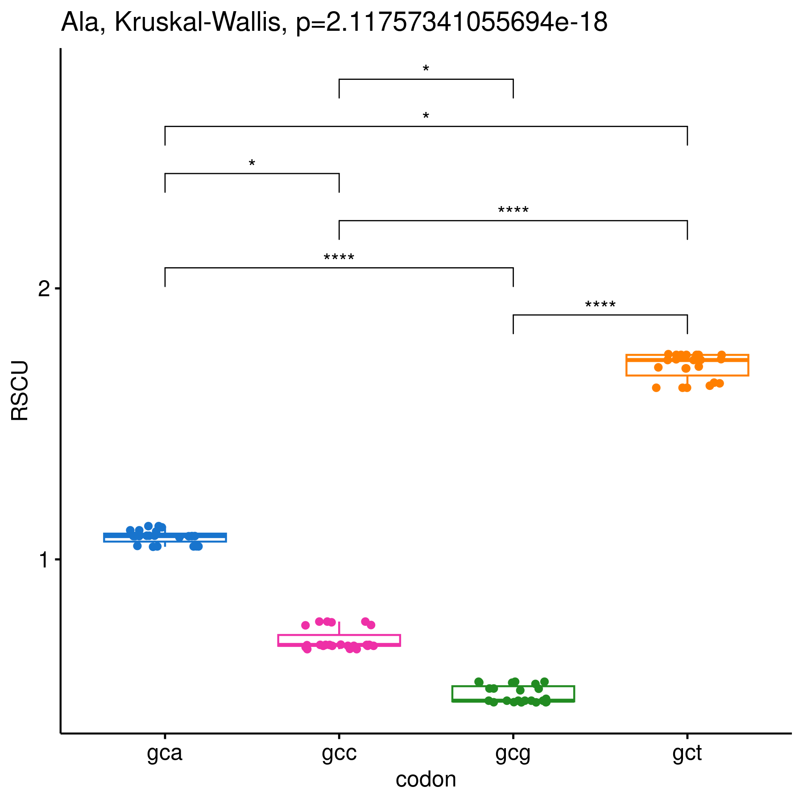

# RSCUcaller

RSCU (relative synonymous codon usage) values of multiple DNA sequences can be analyzed using the RSCUcaller package. The package offers functions to retrieve RSCU information, plot the values, and calculate statistical significance.

The "test_data" folder contains sample data in the form of tables and an R script.

# Installation

```r
install.packages("devtools")
library(devtools)
devtools::install_github('Mordziarz/RSCUcaller')
library(RSCUcaller)
```
To use all features of the program, you will need several libraries.

```r
library(ggplot2)
library(dplyr)
library(seqinr)
library(rstatix)
library(ggpubr)
library(patchwork)
library(forcats)
library(phylogram)
library(circlize)
library(ComplexHeatmap)
library(smplot2)
library(ggtree)
library(stats)
```


# Input data 

Tables and graphics are saved to folders by the RSCUcaller package. To specify the desired output directory, it is recommended to use the setwd() function.

```r
setwd("path/to/your/directory")
```

RSCUcaller requires DNA sequences from NCBI. To begin the analysis, the FASTA file must be prepared appropriately using the prepare_fasta() function. This function requires a table with two columns:

"sequence_path" - This column specifies the path to the FASTA file.

"sample_name" - This column defines the FASTA name, which will be displayed on visualizations and should start with a number followed by an underscore (e.g., 1_Riccia_fluitans).

The "samples_table" should resemble the following. You can create this using a program other than R, such as a simple text editor and then use the write.csv2() function in R.

Ensure that the column names match the column names in the tutorial.

Please ensure that the sample names ("sample_name") and "GENBANK_ACCESSION" are unique. The program requires the names to be as detailed as possible. For example, if the user provides the names "1_A2" and "2_A2.1", the program will treat them as a single sample. However, in the case of names "1_A2.1" and "2_A2.2", the program will function correctly.

When you have FASTA files in separate files

| sequence_path  | sample_name |
| ------------------- | ------------- |
| path/to/your/fasta  | 1_fasta_name  |
| path/to/your/fasta  | 2_fasta_name  |
| path/to/your/fasta  | 3_fasta_name  |
| path/to/your/fasta  | 4_fasta_name  |
| path/to/your/fasta  | 5_fasta_name  |
| path/to/your/fasta  | 6_fasta_name  |
| path/to/your/fasta  | 7_fasta_name  |
| path/to/your/fasta  | 8_fasta_name  |

```r
path1 <- "/path/to/your/fasta"
samples_table <- data.frame(sequence_path = c(path1,path2),
                            sample_name = c("1_fasta_name","2_fasta_name"))
prepare_fasta(samples_table = samples_table,file_out = "your_fasta.fasta")
```
Alternatively, if multiple species from NCBI were downloaded within a single FASTA file, the samples_table with the ID and GENBANK_ACCESSION columns can be used. In this scenario, the path to the FASTA file must also be provided using the path argument.

When you have downloaded multiple FASTA files from NCBI into a single file

| ID  | GENBANK_ACCESSION |
| ------------------- | ------------- |
| 1_fasta_name  | gene_bank_accession_id_1  |
| 2_fasta_name  | gene_bank_accession_id_2  |
| 3_fasta_name  | gene_bank_accession_id_3  |
| 4_fasta_name  | gene_bank_accession_id_4  |
| 5_fasta_name  | gene_bank_accession_id_5  |
| 6_fasta_name  | gene_bank_accession_id_6  |
| 7_fasta_name  | gene_bank_accession_id_7  |
| 8_fasta_name  | gene_bank_accession_id_8  |

```r
samples_table <- data.frame(ID = c("1_fasta_name","2_fasta_name"),
                            GENBANK_ACCESSION = c("gene_bank_accession_id_1","gene_bank_accession_id_2"))
prepare_fasta(samples_table = samples_table, path = "/path/to/multiple/sequence/fasta", file_out = "your_fasta.fasta")
```


The name of the prepared FASTA file needs to be specified regardless of the chosen method. This file will be created and saved in your working directory using the argument file_out="name_of_your_output.fasta".

# Calculating RSCU from multiple sequences

The main function of the package, get_RSCU(), can be used to calculate RSCU values directly from a set of previously prepared sequences.

```r
get_RSCU_out <- get_RSCU(merged_sequences = "your_fasta.fasta")
```

# RSCU matrix

The get_matrix() function allows the user to create a matrix that the user can use in any way they like. The matrix will not be needed for the next steps. Simply use the result of the get_RSCU() function.

```r
get_matrix(get_RSCU_out = get_RSCU_out)
```

# Heatmap

A heatmap and a dendrogram can be drawn using the heatmap_RSCU() function. The heatmap is generated from the output of the get_RSCU() function. To create the heatmap, specify "heatmap" in the select argument and choose a color scheme from "red_green", "green_red", "blue_green", "green_blue", "blue_red", or "red_blue".

```r
heatmap_RSCU(get_RSCU_out = get_RSCU_out, select = "heatmap", heatmap_color = "red_blue")
```


A dendrogram can be obtained by providing the output of the get_RSCU() function and specifying "dendrogram" in the select argument. The result can be further edited using packages like ggtree. The dendrogram will also be saved as a file in your working directory named dendrogram_from_heatmap.newick by the system.

```r
heatmap_RSCU(get_RSCU_out = get_RSCU_out, select = "dendogram")
```


# Histograms

Histograms can be created from the output of the get_RSCU() function using our package.

```r
histogram_RSCU(get_RSCU_out = get_RSCU_out, title = "graph title")
```


Double histograms are plotted using the histogram_RSCU_double() function. This function requires two input parameters: get_RSCU_out_left and get_RSCU_out_right. Additionally, two optional title parameters, title_left and title_right, can be provided.

```r
histogram_RSCU_double(get_RSCU_out_left = get_RSCU_out, get_RSCU_out_right = get_RSCU_out, title_left = "left title", title_right = "right title")
```


# Correlation

Pearson correlation between two species can be performed using the RSCUcaller package. The names of the Species columns in the get_RSCU_out data frame to be correlated should be specified.

```r
correlation(get_RSCU_out = get_RSCU_out, Species_x = "Species_x", Species_y = "Species_y", xlab = "title of x lab", ylab = "title of y lab")
```


# Statistics between groups of individual codons

Statistical analysis of RSCU values at the codon level can be performed using the boxplot_between_groups() function. This function employs the Kruskal-Wallis test to assess significant differences in RSCU values among groups, followed by Dunn's post-hoc test for pairwise comparisons.

To utilize this function, a table named grouping_table needs to be prepared with the following two columns:

"Species"-This column should contain the names of the sequences, corresponding to the Species column from the get_RSCU_out() data frame.

"group"-This column should specify the group to which each sequence belongs.

The function will generate graphical outputs. These outputs will be placed in two folders: selected_species and selected_species_barplots. Additionally, a table named Post_hoc_table_selected_species.csv will be created in the working directory.


The "grouping_table" should look like this: 

Ensure that the column names match the column names in the tutorial.

| Species  | group |
| -------- | ----- |
| Species1  | group1  |
| Species2  | group2  |
| Species3  | group3  |
| Species4  | group4  |
| Species5  | group1  |
| Species6  | group1  |
| Species7  | group2  |
| Species8  | group3  |

```r
boxplot_between_groups(get_RSCU_out = get_RSCU_out, grouping_table = grouping_table, width = 6, height = 6, xlab = "title of x lab", res = 300)
```


# Statistics between amino acids

Statistical analysis and visualizations can be generated for your data using the stat_scat_box() function. This function employs the Kruskal-Wallis test to assess significant differences among groups, followed by Dunn's post-hoc test for pairwise comparisons. A table named Post_hoc_table_aminoacids.csv and three folders, boxplots, barplots and scatter_plots, will also be created in your working directory.

```r
stat_scat_box(get_RSCU_out = get_RSCU_out, width = 6, height = 6, res = 300)
```


# Citation

Paper in preparation

# Support
Any issues connected with the RSCUcaller should be addressed to Mateusz Mazdziarz (mateusz.mazdziarz@uwm.edu.pl).

# Usage in scientific papers

https://doi.org/10.3390/genes15050562

https://doi.org/10.1038/s41598-023-35269-3
